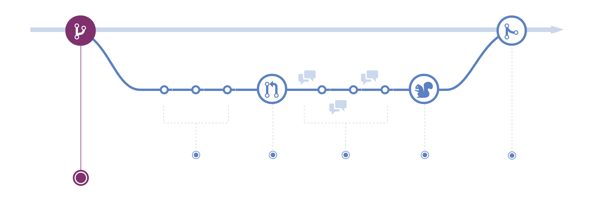

  

<h1 align="center">
   Introduction to Econometrics Using R.
</h1>

Ask a half dozen econometricians what econometrics is, and you could get a half dozen different answers. One might tell you that econometrics is the science of testing economic theories. A second might tell you that econometrics is the set of tools used for forecasting future values of economic variables, such as a firm’s sales, the overall growth of the economy, or stock prices. Another might say that econometrics is the process of fitting mathematical economic models to real-world data. A fourth might tell you that it is the science and art of using historical data to make numerical, or quantitative, policy recommendations in government and business.

In fact, all these answers are right. At a broad level, econometrics is the science and art of using economic theory and statistical techniques to analyze economic data. Econometric methods are used in many branches of economics, including finance, labor economics, macroeconomics, microeconomics, marketing, and economic policy. Econometric methods are also commonly used in other social sciences, including political science and sociology.
This text introduces you to the core set of methods used by econometricians. We will use these methods to answer a variety of specific, quantitative questions from the worlds of business and government policy. This chapter poses four of those questions and discusses, in general terms, the econometric approach to answering them. The chapter concludes with a survey of the main types of data available to econometricians for answering these and other quantitative economic questions.
